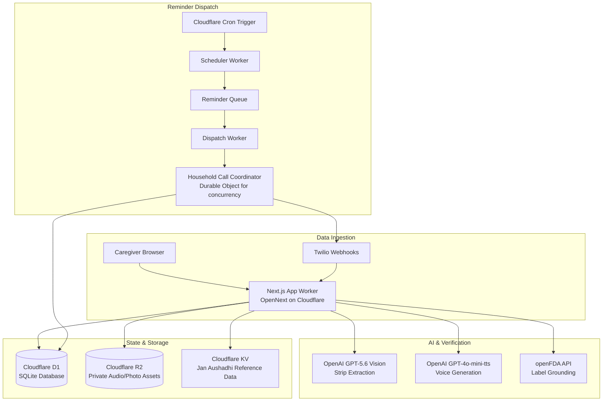

<div align="center">
  <h1>💊 DawaiSaathi</h1>
  <p><b>Snap your meds once. Spoken dosing, interaction checks, and IVR reminders for any phone.</b></p>
  <p><i>Built for the OpenAI Build Week (Codex + GPT-5.6)</i></p>
  <p>
    <a href="https://dawaisaathi.pages.dev"><b>🌐 Use it now — free at dawaisaathi.pages.dev</b></a>
    ·
    <a href="https://github.com/vksh1cool/DawaiSaathi/releases"><b>📱 Download the Android app</b></a>
  </p>
</div>

---

## 💛 The Cause

Elderly patients commonly take 4–8 daily medications. Roughly 50% of patients with chronic diseases do not take medicines as prescribed (WHO estimate). Confusion about *which pill, when, and with/without food* causes hospitalizations that are largely preventable. Furthermore, dangerous interactions go unnoticed across multiple prescriptions, and people overpay for branded molecules because they don't know about generic equivalents like India's Jan Aushadhi program.

**Every existing solution assumes a smartphone-literate patient.** Pill-reminder apps require the patient to read English, install an app, and respond to push notifications. The highest-risk users (rural, elderly, low-literacy) are excluded.

**DawaiSaathi** ("Medicine Companion") splits the roles. The caregiver (e.g., an adult child) snaps photos of the medicine strips to set up the schedule. The patient receives an automated phone call in their own language (Hindi/English) at dose time and simply presses `1` to confirm. No app, no reading required.

## ✨ What it does

- 📸 **Scan & Extract**: Photograph up to 5 medicine strips at once. The AI extracts brand name, salt composition, form, MRP, expiry, and manufacturer in seconds.
- 🗣️ **Spoken Reminders (IVR)**: Places outbound voice calls using Twilio in Hindi or English. The patient just answers the call, listens, and presses `1` on the keypad if they took their medicine.
- 🚨 **Safety Checks**: Cross-references medications against openFDA label data to detect and clearly explain dangerous drug-drug interactions (e.g., Warfarin + Aspirin) without hallucinating.
- 💰 **Generic Savings**: Identifies identical generic medicines from India's Jan Aushadhi program and shows exactly how much money the patient could save each month.
- 📊 **Caregiver Dashboard**: A beautiful, accessible Next.js web app that tracks adherence, upcoming doses, and alerts the caregiver if a dose is missed.

---

## 🏗️ Architecture Under the Hood

DawaiSaathi is built on a decoupled, edge-native architecture on Cloudflare:



## 🚀 Getting Started

The easiest way to try DawaiSaathi is the live dashboard at **[dawaisaathi.pages.dev](https://dawaisaathi.pages.dev)**.

If you want to run it locally or deploy it yourself:

### Prerequisites
- **Node.js 20+**
- **OpenAI API Key**: For GPT-5.6 Vision and TTS generation.
- **Twilio Account**: For live IVR phone calls (simulated calls work in the browser without Twilio).

### Running Locally
```bash
git clone https://github.com/vksh1cool/DawaiSaathi.git
cd DawaiSaathi
npm install

# Setup your .env file
cp .env.example .env
# Edit .env with your OpenAI and Twilio keys

# Run database migrations and seed
npm run db:push
npm run seed
npm run demo:seed

# Start the dev server
npm run dev

# In a separate terminal, run the local background worker for reminders
npm run worker
```
Head over to `http://localhost:3000` to access the dashboard.

### Deploying to Cloudflare Pages
The app uses OpenNext to run on Cloudflare Workers and Pages.
1. Connect this repo to Cloudflare Pages.
2. Set the build command to `npm run cf:build`.
3. Set the output directory to `.open-next/assets`.
4. Configure your D1 database, R2 buckets, and Durable Objects in the Cloudflare dashboard according to `wrangler.jsonc`.

---

## 🛠️ Tech Stack

- **Framework**: Next.js 15 (App Router) running on Cloudflare Workers (via OpenNext).
- **Language**: TypeScript (strict).
- **Database**: SQLite via Prisma ORM (Cloudflare D1).
- **Storage**: Cloudflare R2 (for photos and generated TTS audio).
- **Styling**: Tailwind CSS 4.x with a custom accessibility-first design system.
- **AI**: OpenAI API (`gpt-5.6` for structured extraction, `gpt-4o-mini-tts` for voice).
- **Telephony**: Twilio Programmable Voice (TwiML).

---

## 🎯 The Demo

DawaiSaathi includes a built-in demo persona: **Kamla Devi**.
To experience the app as a caregiver setting up medicines for an elderly patient:
1. Run `npm run demo:seed` to pre-populate Kamla Devi's profile.
2. The UI will guide you through scanning a demo medicine strip, checking interactions, and initiating a simulated phone call.
3. You can hear exactly what Kamla Devi hears in Hindi and confirm the dose by pressing 1.

---

## 🗺️ Roadmap

| Feature | Why it matters |
|---------|----------------|
| **WhatsApp Bot Integration** | Send text-based alerts to the caregiver if a dose is missed, without requiring them to check the dashboard. |
| **Regional Language Expansion** | Add support for Bengali, Tamil, Telugu, and Marathi TTS voices. |
| **Android APK (TWA)** | Wrap the PWA in a Trusted Web Activity for easy installation via the Google Play Store. |
| **Pharmacy Ordering** | Direct integration to re-order medicines when a strip is running low. |
| **Multiple Households** | Allow a single caregiver to manage medicines for both their parents and grandparents simultaneously. |

*Have an idea to improve DawaiSaathi? Open an issue or submit a pull request!*
