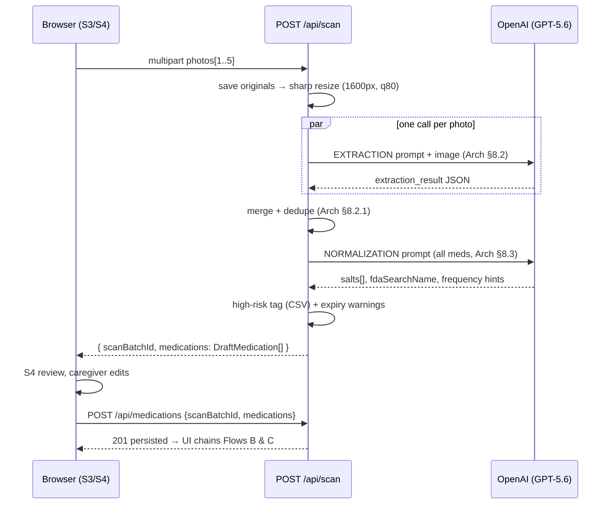
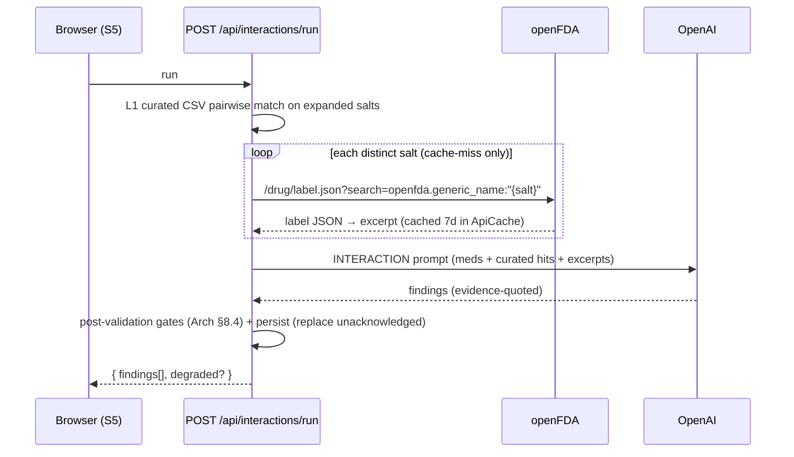
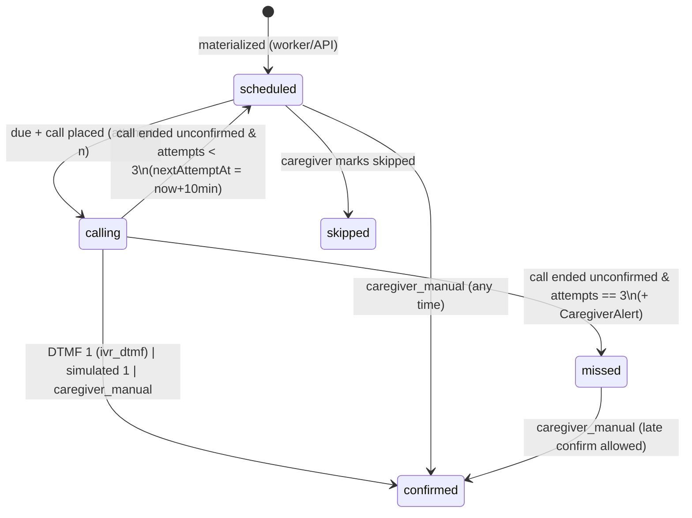
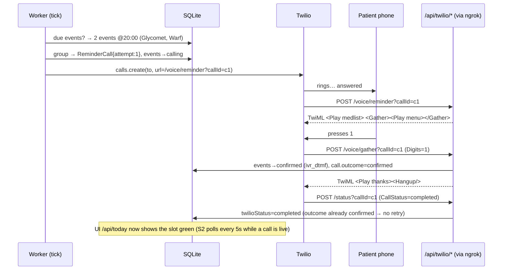

# DawaiSaathi — Data Flow & Integration Doc

| | |
|---|---|
| **Version** | 1.0 (frozen) |
| **Purpose** | How data moves at runtime: end-to-end sequences with payloads, state machines, seed data files, caching/idempotency, and the failure/fallback matrix |
| **Companion docs** | `03-SYSTEM-ARCHITECTURE.md` (contracts referenced as "Arch §n"), `01-PRD.md`, `02-DESIGN.md` |

> **Builder note:** Payload examples below are the ground truth for field names and shapes; they intentionally use the frozen demo kit (PRD §13) so the same values can drive tests and the seeded demo. Implement every row of the failure matrix (§12).

---

## 1. System context

```
Caregiver browser ⇄ Next.js API ⇄ SQLite + storage/ + data/*.csv
                          ⇅                ⇅
                     OpenAI API        Worker (60s tick)
                     openFDA API            ⇅
                                       Twilio Voice ⇄ Patient's phone (PSTN)
```
External integrations: **OpenAI** (vision extraction, normalization, interaction synthesis, schedule suggestion, TTS), **openFDA** (label text), **Twilio** (outbound IVR + webhooks), **ngrok** (public tunnel for Twilio→us traffic).

## 2. Flow A — Scan → Extract → Review → Confirm



**Step detail & example payloads**

1. Upload: `photos` field, 2 files. Server writes `storage/photos/{batchId}/1.jpg…`, rows in `ScanPhoto`.
2. Per-photo extraction (parallel). Raw per-photo result (photo of Warf 5 back foil):
```json
{ "medications": [{
    "brandName": "Warf 5",
    "composition": [{ "saltNameAsPrinted": "Warfarin Sodium IP", "strengthValue": 5, "strengthUnit": "mg" }],
    "form": "tablet", "packSize": 30, "mrpInr": 128.0,
    "expiryDate": "2027-03", "batchNumber": "WF23107", "manufacturer": "Cipla Ltd",
    "fieldConfidence": { "brandName": 0.97, "composition": 0.95, "mrpInr": 0.88, "expiryDate": 0.92 },
    "warnings": [] }],
  "imageIssues": [] }
```
3. Merge/dedupe: same `(brand, strength)` from front+back photos collapses to one entry, best-confidence value per field.
4. Normalization output for the same med (aligned array):
```json
{ "salts": [{ "inn": "warfarin", "fdaSearchName": "warfarin", "strengthValue": 5, "strengthUnit": "mg" }],
  "displayGeneric": "warfarin",
  "usualFrequencyHint": { "timesPerDay": 1, "timing": ["evening"] } }
```
5. Code adds: `highRisk: true, highRiskReason: "Narrow therapeutic index — bleeding risk"` (from `highrisk_meds.csv`), expiry warning if applicable.
6. Response to UI = `DraftMedication[]` (Arch §5). Caregiver edits → `POST /api/medications` persists (salts serialized into `saltsJson`), batch marked `confirmed`.

**Failure handling:** any single photo's extraction failing after retries ⇒ that photo contributes `imageIssues:["photo 2 could not be processed"]`, others proceed; all photos failing ⇒ `502 UPSTREAM_OPENAI`, UI keeps photos for retry. Normalization failure ⇒ retry ×2 then 502 (extraction results are never shown un-normalized).

## 3. Flow B — Interaction check (3 layers)



Demo-kit curated hit (L1) — persisted row (abridged):
```json
{ "pairKey": "aspirin|warfarin", "saltA": "aspirin", "saltB": "warfarin",
  "severity": "major", "source": "curated",
  "explanationEn": "Warf 5 (warfarin) and Ecosprin 75 (aspirin) both make bleeding easier. Together they can cause serious bleeding.",
  "explanationHi": "Warf 5 (warfarin) और Ecosprin 75 (aspirin) दोनों खून को पतला करते हैं। साथ लेने से गंभीर ब्लीडिंग (खून बहने) का खतरा है।",
  "actionEn": "Discuss with your doctor before the next dose.",
  "actionHi": "अगली खुराक से पहले डॉक्टर से बात करें।",
  "evidenceJson": "[{\"source\":\"curated\",\"quote\":\"Additive anticoagulant/antiplatelet effect — increased bleeding risk\"}]" }
```
Pair expansion rule: combination meds expand to salts; a pair is checked once (sorted `pairKey`); pairs *within* one combination product are skipped (co-formulated intentionally).

## 4. Flow C — Generic matching & savings

Deterministic, no LLM. For each active medication:
1. Combination (>1 salt) ⇒ store no-match row with `jaProductName: null` (MVP matches single-salt products only — frozen simplification).
2. Single salt ⇒ find `janaushadhi_products.csv` rows where `generic_name` fuzzy-equals `inn` (Levenshtein ≤2) **and** `strength_value/unit` exactly equal **and** form equal (form mismatch ⇒ confidence `medium`; strength mismatch ⇒ no match; salt-only ⇒ `low`, excluded from total).
3. Unit prices: `jaUnitPriceInr = ja.mrp_inr / ja.pack_size`; `brandUnitPriceInr = med.mrpInr / med.packSize` (photo MRP first, else `brand_prices.csv` by brand name, else null).
4. Monthly units: active schedule ⇒ `times.length × 30`; none ⇒ `usualFrequencyHint.timesPerDay × 30` with `estimated: true`; no hint ⇒ savings null.
5. `monthlySavingsInr = round((brandUnit − jaUnit) × monthlyUnits)`; negative ⇒ clamp to 0 (never show "brand is cheaper" claims from stale data).

Demo-kit expected results (must match seed CSVs in §10 — tested by `generics.test.ts`):

| Medication | Brand ₹/unit | JA ₹/unit | Units/mo | Savings ₹/mo | Confidence |
|---|---|---|---|---|---|
| Telma 40 | 7.80 | 1.00 | 30 | **204** | high |
| Amlong 5 | 3.53 | 0.34 | 30 | **96** | high |
| Glycomet 500 | 1.75 | 0.51 | 60 | **74** | high |
| Ecosprin 75 | 0.66 | 0.28 | 30 | **12** | high |
| Warf 5 | 4.27 | — | 30 | null (no JA match) | — |
| **Total** | | | | **₹386/month** (AC-6.3 ✅ 350–450) | |

## 5. Flow D — Schedule → DoseEvents → TTS pre-generation

1. S7 posts schedules, e.g. Glycomet: `{ times: ["08:00","20:00"], foodRelation: "after_food", startDate: "2026-07-14" }`.
2. API materializes today+tomorrow immediately (same helper as worker, Arch §12.2). Example: `08:00 Asia/Kolkata 2026-07-15` → `scheduledAtUtc: 2026-07-15T02:30:00Z`.
3. TTS pre-generation: after schedules change, server rebuilds each distinct slot's `greeting_medlist` script and warms the audio cache (Arch §11) so the 20:00 call needs zero OpenAI latency.
   - 20:00 slot script (patient `hi`, from template 02-DESIGN §7.2): «नमस्ते कमला जी। मैं दवाई साथी बोल रही हूँ। रात की दवाई का समय हो गया है। कृपया अभी लें — Glycomet 500 की एक गोली, और Warf 5 की एक गोली, खाने के बाद।» *(slot label for 20:00 = शाम/रात boundary: use शाम for 17:00–20:59, रात for 21:00+ — frozen rule in `dates.ts`)*
4. Static audios (`menu/thanks/goodbye_*`) exist from seed (`pregen-audio.ts`).

## 6. Audio asset lifecycle

```
scriptText ──sha256(lang|voice|text)──► exists in AudioAsset? ──yes──► reuse filePath
                                              │no
                                              ▼
                                   OpenAI TTS → storage/audio/{hash}.mp3 → insert row
```
Serving: `GET /api/audio/{hash}.mp3` (regex-validated). Twilio fetches these via `PUBLIC_BASE_URL`. Cache is content-addressed ⇒ med list changes automatically produce a new file; stale files are harmless and removed by `purge`.

## 7. Flow E — Reminder call lifecycle (the core loop)

### 7.1 DoseEvent state machine



### 7.2 Happy path sequence (20:00 dose, attempt 1)



Webhook payloads (form-encoded, relevant fields): reminder/gather receive `CallSid, From, To, Digits?`; status receives `CallSid, CallStatus ∈ queued|ringing|in-progress|completed|busy|no-answer|failed|canceled`.

### 7.3 Retry path
`no-answer` → status webhook → events: `attempts=1`, back to `scheduled`, `nextAttemptAtUtc=+10 min` → worker tick at T+10 places attempt 2 → … → after attempt 3 unconfirmed ⇒ `missed` + `CaregiverAlert`:
```json
{ "type": "missed_dose",
  "messageEn": "Kamla did not confirm the evening medicines (3 calls tried).",
  "messageHi": "कमला जी ने शाम की दवाई की पुष्टि नहीं की (3 बार फ़ोन किया गया)।" }
```
Stuck-call sweep: any event `calling` with `updatedAt` >5 min and call not concluded ⇒ treated as unconfirmed attempt (protects against lost webhooks).

## 8. Flow F — Simulated call (demo fallback, AC-10.1)

`POST /api/simulate/start {time:"20:00"}` → same grouping/TTS as §7.2 but `mode:"simulated"`, no Twilio → returns all four audio URLs → M1 modal plays medlist+menu → user taps on-screen `1` → `POST /api/simulate/digits {reminderCallId, digits:"1"}` → **same** `handleGatherResult()` → events `confirmed (simulated)`. Tapping nothing for 16 s ⇒ modal auto-posts `digits:""` → no-input path (attempt counted, retry scheduling identical). Guarantee: real and simulated calls are indistinguishable at the DB layer except `mode` + `confirmedVia`.

## 9. Flow G — Adherence & today view
`GET /api/today` groups the patient-local day's DoseEvents by slot; group status = `confirmed` (all), `missed` (any missed, none pending), `upcoming` (any scheduled/calling), else `mixed`. `GET /api/adherence?days=7` (AC-11.1): `percent = confirmed / (confirmed + missed)`, `skipped` and still-`scheduled` excluded; `byDay` buckets in patient tz.

## 10. Seed & reference data (`data/*.csv` — ship exactly these columns; rows below are the frozen starter set)

> Prices are approximate 2025 MRPs for demo purposes — banner "approx. MRP, verify locally" (PRD risk table). Encoding UTF-8, comma-separated, header row required. `prisma/seed.ts` loads all four files.

### 10.1 `curated_interactions.csv`
Columns: `salt_a,salt_b,severity,mechanism_en,explanation_en,explanation_hi,action_en,action_hi` (salts lowercase INN, alphabetical order per row).

| salt_a | salt_b | severity | mechanism_en |
|---|---|---|---|
| aspirin | warfarin | major | Additive anticoagulant/antiplatelet effect — increased bleeding risk |
| ibuprofen | warfarin | major | NSAID + anticoagulant — GI bleeding risk |
| aspirin | clopidogrel | moderate | Dual antiplatelet — bleeding risk unless prescribed together deliberately |
| amlodipine | simvastatin | moderate | CYP3A4 interaction — simvastatin dose should not exceed 20 mg |
| spironolactone | telmisartan | moderate | ARB + potassium-sparing diuretic — hyperkalemia risk |
| potassium chloride | telmisartan | moderate | ARB + potassium — hyperkalemia risk |
| isosorbide dinitrate | sildenafil | major | Nitrate + PDE5 inhibitor — severe hypotension |
| sertraline | tramadol | major | Serotonin syndrome risk |
| atorvastatin | clarithromycin | moderate | CYP3A4 inhibition — myopathy risk |
| metoprolol | verapamil | moderate | Additive cardiac depression — bradycardia risk |

(Each row also carries the four bilingual explanation/action strings in the pattern of §3's example — write them in the CSV, ≤3 sentences, 8th-grade level, "अगली खुराक से पहले डॉक्टर से बात करें।" as `action_hi`.)

### 10.2 `janaushadhi_products.csv`
Columns: `product_code,generic_name,strength_value,strength_unit,form,pack_size,mrp_inr`

```csv
JA001,telmisartan,40,mg,tablet,10,10.00
JA002,amlodipine,5,mg,tablet,10,3.40
JA003,metformin,500,mg,tablet,10,5.10
JA004,aspirin,75,mg,tablet,14,3.90
JA005,atorvastatin,10,mg,tablet,10,13.00
JA006,pantoprazole,40,mg,tablet,10,8.50
JA007,paracetamol,650,mg,tablet,10,6.60
JA008,metoprolol,25,mg,tablet,10,8.00
JA009,losartan,50,mg,tablet,10,9.00
JA010,glimepiride,1,mg,tablet,10,4.00
JA011,telmisartan,80,mg,tablet,10,17.00
JA012,metformin,1000,mg,tablet,10,9.80
```

### 10.3 `brand_prices.csv`
Columns: `brand_name,manufacturer,generic_name,strength_value,strength_unit,form,pack_size,mrp_inr`

```csv
Telma 40,Glenmark,telmisartan,40,mg,tablet,30,234.00
Amlong 5,Micro Labs,amlodipine,5,mg,tablet,30,106.00
Glycomet 500,USV,metformin,500,mg,tablet,20,35.00
Ecosprin 75,USV,aspirin,75,mg,tablet,14,9.30
Warf 5,Cipla,warfarin,5,mg,tablet,30,128.00
Dolo 650,Micro Labs,paracetamol,650,mg,tablet,15,33.60
Pan 40,Alkem,pantoprazole,40,mg,tablet,15,155.00
Atorva 10,Zydus,atorvastatin,10,mg,tablet,30,95.00
```

### 10.4 `highrisk_meds.csv`
Columns: `salt,reason_en,reason_hi,special_check`

```csv
warfarin,Narrow therapeutic index — bleeding risk,खून पतला करने की दवा — विशेष सावधानी ज़रूरी,none
insulin,Hypoglycemia risk — dosing errors dangerous,शुगर बहुत कम होने का खतरा,none
methotrexate,Usually WEEKLY dosing — daily intake is dangerous,आमतौर पर हफ़्ते में एक बार — रोज़ लेना खतरनाक,weekly_check
digoxin,Narrow therapeutic index,दिल की दवा — विशेष सावधानी ज़रूरी,none
lithium,Narrow therapeutic index — levels must be monitored,विशेष निगरानी ज़रूरी,none
amiodarone,Multiple serious interactions,कई दवाओं के साथ गंभीर प्रतिक्रिया,none
phenytoin,Narrow therapeutic index,विशेष सावधानी ज़रूरी,none
carbamazepine,Many interactions via liver enzymes,कई दवाओं पर असर डालती है,none
glimepiride,Hypoglycemia risk in elderly,बुज़ुर्गों में शुगर कम होने का खतरा,none
glibenclamide,Hypoglycemia risk in elderly,बुज़ुर्गों में शुगर कम होने का खतरा,none
tramadol,Serotonin syndrome & dependence risk,विशेष सावधानी ज़रूरी,none
```
`special_check=weekly_check` powers the methotrexate schedule guard (PRD F2, 02-DESIGN S7).

### 10.5 i18n string files
`src/lib/i18n/en.json` + `hi.json` — every key referenced in `02-DESIGN.md` plus screen strings; structure nested by screen (`home.*, scan.*, review.*, safety.*, savings.*, schedule.*, history.*, profile.*, onboarding.*, legal.*, brand.*`). Hindi is a full translation, not partial.

### 10.6 Demo seed (`POST /api/demo/seed` creates)
Household: caregiver "Priya", ui `en`. Patient: "Kamla Devi", phone = `DEMO_PATIENT_PHONE` env (presenter's verified number), language `hi`, voice `female`, tz `Asia/Kolkata`. Medications: the 5 demo-kit meds with §10.3 prices, photo-MRP fields set, Warf 5 `highRisk`. Schedules: Telma+Amlong+Ecosprin 08:00 after_food; Glycomet 08:00+20:00 after_food; Warf 20:00 any. Pre-warm: all slot audios + interaction & generics runs executed → app opens "lived-in" (matches PRD §14 script).

## 11. Caching & idempotency matrix

| Concern | Mechanism | Key | TTL / rule |
|---|---|---|---|
| openFDA labels | `ApiCache` | `openfda:label:{salt}` | 7 days |
| TTS audio | `AudioAsset` + file | sha256(lang\|voice\|text) | forever (content-addressed) |
| DoseEvent creation | DB unique | `(scheduleId, scheduledAtUtc)` | upsert ⇒ re-runs safe |
| Twilio webhooks | `ReminderCall.twilioCallSid` unique; gather idempotent (confirm twice = no-op) | CallSid | — |
| Interaction runs | `runId`; run replaces unacknowledged findings only | pairKey | acknowledged rows persist |
| Generics runs | delete+recreate per medication | medicationId | — |
| Scan | new batch per request; photos immutable | batchId | — |

## 12. Failure / fallback matrix (implement every row; test the ⭐ rows)

| Dependency | Failure | System behavior | User experience |
|---|---|---|---|
| OpenAI (vision) ⭐ | 429/5xx/timeout | retry ×2 backoff; per-photo isolation (§2) | partial results + "photo n unreadable"; full fail → retry screen, photos kept |
| OpenAI (normalize/interact/schedule) | same | retry ×2; then 502 | S3/S5 error state with [Try again] |
| OpenAI (TTS) | fail at call time | worker falls back to cached asset if any; else Twilio `<Say>` fallback with English text (last resort, logged) | call still happens |
| openFDA ⭐ | down/empty | curated + llm layers only; response `degraded:"openfda_unavailable"` | S5 amber banner "Checked against built-in database only" |
| Twilio create-call ⭐ | error/no env | events revert to scheduled +10 min; `TELEPHONY_DISABLED` on demo endpoints | S2 shows "call could not be placed"; presenter uses M1 simulated call |
| Twilio webhooks | never arrive | stuck-`calling` sweep >5 min ⇒ counted as unconfirmed attempt (§7.3) | retries still happen |
| ngrok | tunnel died | Twilio can't fetch TwiML → call fails → status/sweep path | simulated call; restart ngrok + update `PUBLIC_BASE_URL` |
| SQLite | locked (two writers) | Prisma retry once; worker tick skips on failure, next tick recovers | none visible |
| Patient phone | off/unreachable | `no-answer` retry path → missed + alert | caregiver alert on S2 |

## 13. Data retention & privacy flows
- Everything local (Arch §14). Public exposure limited to hash-named audio, validated photo paths, signed Twilio webhooks.
- Deletions: per-photo delete (S9) removes file + row; "Erase all data" & `npm run purge` truncate all tables + delete `storage/**`; archiving a medication deactivates schedules but keeps DoseEvent history (adherence integrity).
- Logs: phone numbers redacted to last 4 digits (Arch §14).

## 14. End-to-end timing budget (demo-critical path)

| Segment | Budget | Mechanism |
|---|---|---|
| Scan (5 strips, 2 photos) | ≤25 s | parallel vision calls + resized images |
| Interactions run | ≤20 s | cache-warm openFDA (seed pre-warms demo salts) + single LLM call |
| Generics run | ≤1 s | pure CSV/DB computation |
| "Call now" → phone rings | ≤10 s | audio pre-warmed at schedule time; only Twilio dial latency remains |
| DTMF 1 → UI shows green | ≤6 s | gather webhook write + S2 5 s polling while call live |
