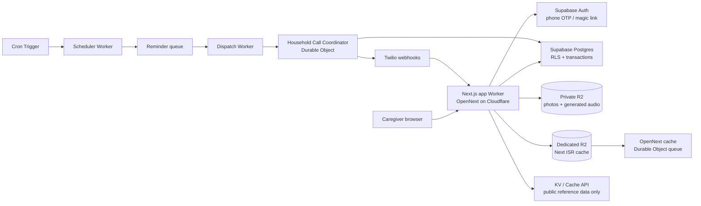

# DawaiSaathi — Cloudflare Production Architecture

| | |
|---|---|
| **Status** | Required production migration before inviting real households |
| **Decision** | Use **Supabase** for Postgres + Auth + authorization; use Cloudflare Workers, Queues, Durable Objects, private R2, and scoped caching around it. |
| **Do not use as primary record store** | Cloudflare D1 for medication, reminder, call, or adherence data. |

## 1. Why this decision exists

The current local demo has a single unpartitioned SQLite household. Its reminder lifecycle deliberately uses transactions to prevent duplicate calls, double confirmations, and partially saved medicine changes.

Cloudflare D1 itself is useful for edge-oriented SQLite work, but Prisma's D1 adapter currently has no transaction support. That is incompatible with a medication reminder system where a multi-step state change must either complete together or not happen at all. A D1 configuration remains useful only for disposable local Worker validation; it is **not** a production health-data deployment target.

Choose **Supabase**, not a combined Supabase + Neon stack:

| Need | Supabase | Neon |
|---|---|---|
| PostgreSQL transactions | Yes | Yes |
| Built-in user identity | Yes | Separate provider required |
| Row-level authorization | Yes, via Postgres RLS | Possible, but requires separately designed JWT/RLS plumbing |
| Existing Prisma compatibility | Yes, through Postgres/Prisma | Yes, through the serverless driver |
| Best fit for DawaiSaathi | **Yes** — one accountable identity + data boundary | Good only if a separate auth/tenant system already exists |

Supabase is not a compliance certification. Before real patient data is collected, select an appropriate region and complete legal/privacy, consent, retention, deletion/export, incident-response, telephony, and vendor-review work for every launch country.

## 2. Target topology



### Worker responsibilities

1. **App Worker** — serves the UI, authenticated APIs, Twilio webhooks, and private asset authorization. It must never expose a Supabase service-role key to the browser.
2. **Scheduler Worker** — Cron Trigger materializes due work every minute. It only discovers due jobs and enqueues idempotent messages; it does not call a patient directly.
3. **Dispatch Worker** — Queue consumer performs retries with backoff and dead-letter handling. Every message carries an immutable `doseEventId`/idempotency key, never a medicine name or phone number.
4. **`HouseholdCallCoordinator` Durable Object** — one object name per household. It serializes only short-lived reminder/call claims so concurrent cron ticks, queue retries, manual actions, and Twilio callbacks cannot double-place a call. It stores no long-term health record; Postgres remains authoritative.

Do not add Durable Objects for ordinary CRUD or as a second database. They earn their place here only as a per-household concurrency boundary.

## 3. Data and authorization model

Before migration, replace the global `findFirst()` household behavior with an explicit tenant model:

```text
auth.users (Supabase-managed)
  └─ profiles (user id, display preferences)
      └─ household_members (user id, household id, role)
          └─ households
              └─ patients, medications, schedules, dose_events,
                 reminder_calls, findings, alerts, scan_batches, scan_photos
```

Rules:

- Every protected row carries `household_id`, including rows reachable through a patient or scan batch. Keep indexes beginning with `household_id` for each high-volume query.
- Enable RLS on every browser-exposed table and make policies derive membership from the authenticated Supabase user. Never accept a household ID from the browser as authorization.
- The app Worker forwards the user's Supabase session to the authenticated data layer. A private scheduled/queue Worker gets its own narrowly scoped credential and performs all writes in a transaction.
- Use a unique database constraint for each materialized dose event and a unique idempotency key for each outbound reminder attempt. The database, not a cache or UI button state, is the final duplicate-prevention layer.
- Twilio webhook routes verify Twilio signatures, resolve the call to its household server-side, and transition call/dose state transactionally.

## 4. R2 object storage

Use one **private** R2 bucket, `dawaisaathi-private-assets`:

- Opaque keys only: `photos/{scanBatchUuid}/{ordinal}.webp` and `audio/{contentHash}.mp3`. Do not put patient names, phone numbers, or medicine names in keys or custom metadata.
- No public bucket domain. Browser downloads pass through the Worker after membership authorization.
- Voice URLs for Twilio use a short-lived, HMAC-signed bearer token scoped to one audio file. They are delivery URLs, not public assets.
- R2 is the content cache for generated TTS audio. A content hash prevents duplicate generation without putting the audio in a public HTTP cache.
- Delete original photos by household/scan batch when requested; make object deletion part of the same audited deletion workflow as database cleanup.

## 5. Caching policy

| Data class | Storage/cache | Policy |
|---|---|---|
| Next JS/CSS/font assets | Cloudflare static asset/CDN cache | Public, immutable asset hashes only |
| Next static/ISR shell | Dedicated `dawaisaathi-next-cache` R2 bucket + OpenNext DO queue | Static/ISR content only; no household data or authenticated API responses |
| UI language packs and app shell | Build/static cache | No health data |
| Curated medicine reference data | Versioned KV or bundled data | Public/reference-only; versioned invalidation |
| openFDA label excerpts | KV or Cache API with a bounded TTL | Public upstream reference only; never mix with a household key |
| TTS bytes | Private R2, content-addressed | Reuse server-side; HTTP delivery is `private, no-store` |
| Prescription photos | Private R2 | Always `private, no-store` |
| Household, medicines, schedules, reminders, calls, adherence | Postgres | `Cache-Control: private, no-store`; never Cache API/KV/shared CDN |
| Sessions, OTP state, rate limits | Supabase Auth / narrowly scoped KV | Short TTL; no medical payloads |

Never include `Authorization`, cookies, phone numbers, patient names, medicine names, household IDs, or a signed media URL in a shared Cache API/KV cache key. A cache miss may be slower; a privacy leak is not an acceptable optimization.

## 6. Supabase setup checklist

1. Create a Supabase project in the required data region; record its project URL and anon key as Worker secrets, never repository variables.
2. Enable the selected sign-in methods. Start with phone OTP only if regional SMS deliverability, cost, recovery, and accessibility have been tested; retain magic-link/email recovery for caregivers who can use it.
3. Create the tenant/membership schema and RLS policies before copying any real data.
4. Create a dedicated database role for migrations/Worker maintenance. Do not use a browser-visible service key for normal app calls.
5. Convert the Prisma schema from SQLite to PostgreSQL and generate a fresh migration. Use the Supavisor pooler or Cloudflare Hyperdrive for Worker-to-Postgres connections; never ship a native Prisma engine.
6. Backfill the current demo household only as synthetic data. Validate cross-household denial, duplicate webhook delivery, queue retry, clock/timezone boundaries, and deletion before enabling live calls.
7. Store `SUPABASE_URL`, `SUPABASE_ANON_KEY`, database connection credentials, Twilio secrets, AI keys, and access secrets using `wrangler secret put`; do not put them under `vars` or commit `.dev.vars`.

## 7. Rollout gates

No real-data deployment until all gates pass:

1. A user from household A receives a 404/403 for every household-B API route, photo, audio URL, reminder, and webhook-derived identifier.
2. A duplicate queue message or Twilio webhook cannot create a second call or alter a settled dose state.
3. A Worker restart during a call produces either one valid retry or a clear failed state—never a silent lost dose.
4. All private media routes return `private, no-store`; a response without a valid session or scoped Twilio token is denied.
5. Audit logs redact phone numbers and medicine payloads; errors never include secrets or raw prescription image data.
6. Database backup/restore, data export, and household deletion are rehearsed against synthetic data.
7. A canary deployment runs simulated calls first, then a staff-only live-call cohort, before wider invitation.

## 8. Primary references

- Cloudflare's [Next.js on Workers guide](https://developers.cloudflare.com/workers/framework-guides/web-apps/nextjs/)
- Cloudflare [R2 Workers API](https://developers.cloudflare.com/r2/get-started/workers-api/)
- Cloudflare [Hyperdrive](https://developers.cloudflare.com/hyperdrive/)
- Supabase [Auth](https://supabase.com/docs/guides/auth) and [Row Level Security](https://supabase.com/docs/guides/database/postgres/row-level-security)
- Prisma's [Cloudflare D1 limitations](https://docs.prisma.io/docs/orm/core-concepts/supported-databases/sqlite)
